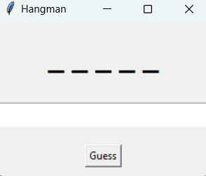
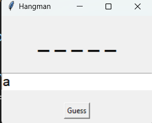
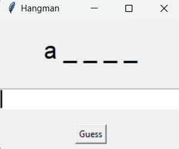
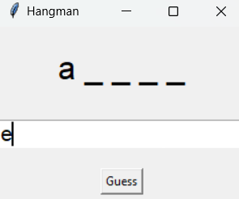
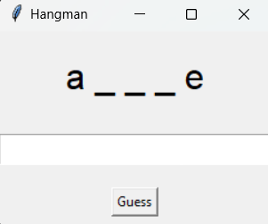
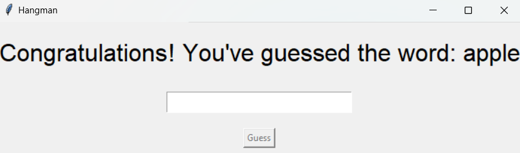

# Tkinter Hangman Game

## Description
This is a Hangman game implemented in Python using the Tkinter library. The game randomly selects a word, and the player must guess the word one letter at a time. The player has a limited number of chances based on the length of the word.

## Features
- GUI-based gameplay using Tkinter.
- Feedback on whether the guessed letter is correct or not.
- A limited number of chances to guess the word.
- Congratulatory or failure messages based on the player's performance.

## Example Walkthrough
1. The game randomly selects a word from a predefined list.
2. The player enters a letter and clicks "Guess" to check if the letter is in the word.
3. The game shows the current state of the word and the number of remaining chances.
4. If the player guesses all the letters correctly, they win.
5. If the player runs out of chances, the game ends with a "game over" message.

## How to Run

1. Clone or download the repository.
2. Open the terminal or command prompt in the project folder.
3. Run the following command:

    ```bash
    python hangman_tkinter.py
    ```

4. A GUI window will appear where you can start guessing the word.

## Dependencies

This game requires Python 3.x and Tkinter (which comes pre-installed with Python).

## Time Complexity
The time complexity of this game depends on the number of letters in the word. For each guess, it checks the word to see if the guessed letter exists, so the time complexity is O(n) where n is the length of the word.

## Space Complexity
The space complexity is O(n), where n is the length of the word, due to the storage of the word and guessed letters.

## Screenshot











Last image :

